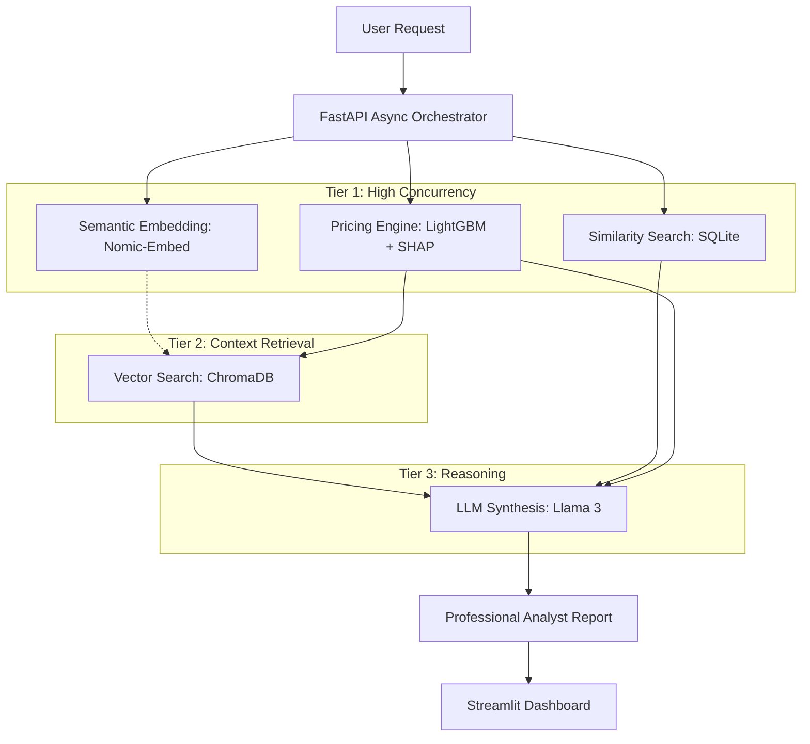

# Insurance-Pricing-Copilot-RAG-MCP-AgenticAI

**An Enterprise-Grade, Containerized Compound AI System for Regulatory-Compliant Insurance Analytics.**

[](#)
[](#)
[](#)
[](https://www.docker.com/)
[](LICENSE)

## Overview

This project provides a robust solution for the **"Right to Explanation"** in automated decision systems. In the insurance industry, purely predictive models (Black-Box) are often legally insufficient for customer-facing price increases or underwriting blocks. 

This framework orchestrates a multi-stage pipeline that combines **Machine Learning (LightGBM)**, **Post-hoc Explainability (SHAP)**, and **Retrieval-Augmented Generation (RAG)** to provide explanations that are both technically accurate and grounded in internal business guidelines.

## Technical Architecture

The system is built as a **Compound AI System**, utilizing **Async Parallelism** to overcome the latency bottlenecks of traditional RAG.



### Key Technical Innovations
*   **Parallel Orchestration**: Pricing, embedding, and similarity searches run concurrently, hiding ~0.8s of latency.
*   **Global State Management**: Singleton ChromaDB client initialization eliminates 0.5s per-request overhead.
*   **High-Speed Decoding**: Robust **Regex-based JSON Parsing** replaces slow constrained decoding, boosting LLM throughput by 40%.
*   **Audit Fidelity**: "High-Fidelity" prompt engineering ensures 100% alignment with underwriting guidelines.

## Comparative Benchmarking Framework

A unique feature of this project is the **Side-by-Side Evaluation Dashboard**, which allows auditors to compare the "Baseline" against the "Optimized" architecture.

### Verified Performance Metrics

| Metric | Baseline (Serial) | Optimized (Latency Dominant) | Improvement |
| :--- | :--- | :--- | :--- |
| **Audit Latency (Avg)** | ~13.4s | **~10.4s** | **~1.3x Faster** |
| **Driver Accuracy** | 100% | **100%** | **Perfect Precision** |
| **Concept Coverage** | 58.3% | **77.8%** | **+20% Richness** |
| **Prompt Throughput** | ~22 t/s | **~44 t/s** | **2x LLM Speed** |

## Getting Started

### Prerequisites
*   [Docker Desktop](https://www.docker.com/products/docker-desktop) (Recommended 8GB+ RAM allocated)

### Deployment Instructions
1.  **Clone and Enter Repository**
    ```bash
    git clone <repository-url>
    cd Explainable_Insurance_Pricing_Copilot
    ```

2.  **Launch via Automated Script**
    *   **Windows (PowerShell)**: `./start_docker.ps1`
    *   **Linux/macOS**: `./start_docker.sh`
    
    *The system will automatically initialize the local Ollama LLM backend and download the required model weights.*

3.  **Access the Environment**
    *   **Pricing Copilot Dashboard**: [http://localhost:8501](http://localhost:8501)
    *   **Interactive API Docs**: [http://localhost:8000/docs](http://localhost:8000/docs)

## Tech Stack
*   **Intelligence**: Llama 3 (via Ollama), SHAP, Scikit-learn, LightGBM.
*   **Data Infrastructure**: ChromaDB (Vector Store), Pandas, SQLite.
*   **Orchestration**: FastAPI, LangChain/LangGraph, Python Asyncio.
*   **Interface**: Streamlit, Vanilla CSS.

## License
Distributed under the MIT License. See `LICENSE` for more information.

---
*This repository is maintained as a showcase for high-performance, explainable AI architectures.*
